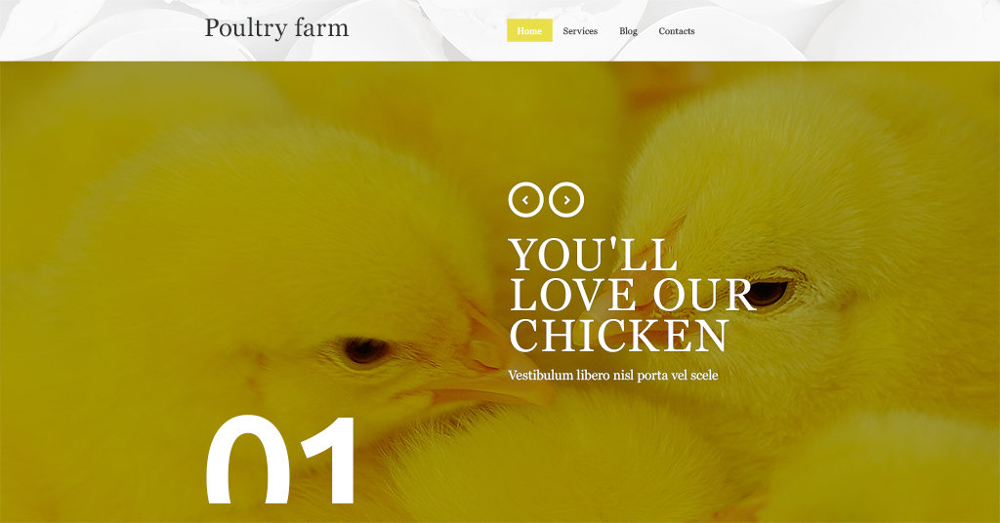

# UaWebChallengeVII task for Middle/Senior front-end dev. Верстка. Semifinal

## Contents
* [Folder structure](#folder-sctructure)

###### Technologies: Html5, Jade, Css3, JS, jQuery, Sass, Grunt, Bower.
###### Compatible browsers: IE9+, Firefox, Chrome, Opera, Safari, Yandex.browser


---

##Folder-structure
```
.
├── .editorconfig
├── Gruntfile.js
├── package.json
├── bower.json
├── README.md
├── Rakefile
└── dev
    ├── css                                compiled css
    │   └── screen.css
    ├── img                                image sources
    │   └── *.png, *.jpg, *.gif
    ├── templates                          jade templates
    │   ├── pages                          main pages templates
    │   │   └── index.jade
    │   ├── components                     page components
    │   │   ├── meta.jade, parked
    │   │   └── common                     common page blocks
    │   │       ├── body_src.jade
    │   │       └── head_src.jade
    │   └── helpers                        mixins and vars
    │       └── mixins.jade
    ├── js                                 scripts
    │   ├── assembled.js
    │   ├── custom.js
    │   ├── head                           head scripts
    │   │   └── head.js
    │   └── vendor                         vendor scripts
    │       └── vendor.js
    ├── styles                             preprocessor styles
    │   ├── screen.sass
    │   └── components                     stylesheet components
    │       ├── _reset.sass
    │       ├── _fonts.sass
    │       └── _block.sass
    ├── html                               compiled html files
    │   └── index.html                     
    ├── helpers                            robots.txt, favicon, etc
    │   └── *.*                            
    ├── fonts                              font sources
    └── devtools                           some developer tools

```  
